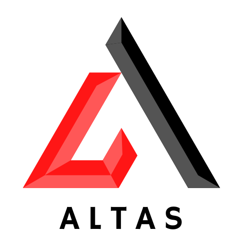

<!-- PROJECT LOGO -->
<br />
<div align="center">
  <a href="https://github.com/jackmulligan-ire/altas">
    
  </a>

<h3 align="center">Altas</h3>

  <p align="center">
    Python package to scrape webpages and transcribe video content from a video sharing platform.
  </p>
</div>

## **About Altas**

Altas is a Python package that was developed to gather data on a video sharing platform. The focus here was on the videos posted on the platform themselves, with speech data and metadata (e.g. video views, hashtags) gathered from each video. The aim of the package is to enable the analysis of the data gathered and to allow this to be done for a large sample of creators. Analysis questions to be answered include identifying topics discussed by each creator, determining how these topics shifted over time, as well as co-occurrence of topics.

The package gathers data in three stages: In the first stage, a channel is scraped for a history of videos published using Selenium and BeautifulSoup, with the webpage associated with each video being gathered. In the second stage, each webpage associated with that video is scraped using BeautifulSoup for the URL associated with the video file as well as video metadata. Finally, the video file is downloaded and then transformed to audio, with the audio being sent up to the Google Cloud Speech API. The end product is an audio transcription and its associated metadata.

Please note that this repository exists for demonstration purposes and isn't functional as the video sharing website has been anonymised. This has been done to protect the integrity of the project that continues to utilise Altas in its work. A separate, private repository is used in practice.

### Built With


## Getting Started

The following is required to use the repo:

- A clone of the repository: `git clone <HTTPS link/SSH link>`
- A virtual environment manager ([Anaconda/Miniconda](https://www.anaconda.com/) recommended)
- Google Chrome or a Chromium browser and chromedriver for browser version (Windows, Mac OS) / chromedriver (Linux)
- A [Google Cloud Platform](https://www.cloud.google.com) account and a `credentials.json` file for the Speech API.

### Package structure

The following folder structure must be created to use altas.

```
├── altas
├── data
    ├── logs                # Error logs
    ├── tmp                 # Converting video to audio
    ├── channel-sample.csv  # Channels to scrape
├── environment.yml
├── requirements.txt
├── run-pipeline.sh
├── .gitignore
└── README.md
```

`.gitignore` prevents the data file from being pushed to the repository.

### Creating an initial channel sample

The `channel-sample.csv` file must be initialised with the following schema: `id,channel_name,date_scraped`.

These correspond as follows:

- id: The id associated with that channel on the platform (required).
- channel_name: An optional alias for the channel.
- date_scraped: Initially left blank.

A minimum valid entry into the channel-sample.csv file is as follows : `123abcd,,`

### Installing the virtual environment

To install the environment using conda, simply run `conda env create -f environment.yml`

To activate the environment, run `conda activate altas`.

A `requirements.txt` file is also available should you wish to use another virtual environment manager.

### Installing chromedriver

A version of [chromedriver](https://chromedriver.chromium.org/downloads) compatible with your version of Chrome must be downloaded and made available when running the program. This is best placed in the `bin` folder of your conda environment file e.g. on Mac OS `/path/to/anaconda/envs/covid-19-narrative/bin`.

For Linux users, the latest version of chromedriver for your Linux distribution must be downloaded and placed in a binary folder on the PATH.

### Getting credentials to use the Google Cloud Speech API

An account on the Google Cloud Platform is required to use [Google Cloud Speech](https://cloud.google.com/speech-to-text/). After setting up a Google Cloud Platform account, the [set up instructions](https://cloud.google.com/speech-to-text/docs/before-you-begin) for using the platform should be followed.

The end result of set up is a `credentials.json` file required to make API requests, which must be available in your environment's PATH. The most convenient way to do this is to add the line `export GOOGLE_APPLICATION_CREDENTIALS="path\to\credentials.json"` directly to your `~\.bash_profile` \ `~\.bashrc` file (or equivalent for your shell).

## Using Altas

### Scraping channels

To scrape the channels in `channel-sample.csv`, run the following command from the top-level directory: `python -m altas scrape_channel_pages`

This command will scrape all channels that have no entry for date_scraped in `channel-sample.csv` . This creates a `data\channel-data.csv` file with the following schema: 

`id,title,date(YYYY-MM-DD),length(H:MM:SS),views,channel_name`

The file is created new only if it's not present in the data folder, with subsequent command calls appending to the existing `channel-data.csv` file.

Once a channel has been scraped, the current date is entered under the `date_scraped` column of the `channel-sample.csv` file. This will prevent the channel from being scraped again if the command is run again. The timestamp can simply be removed from the `channel-sample.csv` file to perform a second scraping. Each `id` within `video-page-data.csv` must be unique, preventing the same video from a channel being scraped more than once.

### Scraping videos

To the scrape each video page in `channel-data.csv`, run the following command from the top-level directory: `python -m altas scrape_video_pages`

This command will create a `data\video-page-data.csv` with the following schema:

`id,video_url,title,date,channel,description,category,hashtags` 

The file is created new only if it's not present in the data folder, with subsequent command calls appending to the existing `video-page-data.csv` file. Each `id` within `video-page-data.csv` must be unique, preventing the same video page from being scraped more than once.

### Transcribing videos

To create a transcription of each video in `video-page-data.csv`, run the following command from the top-level directory: `python -m altas transcribe_videos`

When this command is run for the first time, it will create a `data\video-transcription-data.csv` file with the following schema: 

`id,transcript`

The file is created only if it's not present in the data folder, with subsequents command calls appending to the existing `video-transcription-data.csv` file. Each id within `video-transcription-data.csv` must be unique, preventing the same video file from being transcribed more than once.

### Running the pipeline end to end

It's also possible to run through each of the three stages as a pipeline. Simply enter the desired channel ids into the `channel-sample.csv` file, then run `bash run-pipeline.sh` from the top-level directory. For a channel or channels with longer video histories, this will take a long time to run to completion.

### Joining the three data tables together

The three data tables, `channel-data.csv`, `video-page-data.csv` and `video-transcription-data.csv` all share a common feature in `id`. The `id` feature is also unique for each table, serving as a primary key. This allows the three tables to be easily joined together, allowing for a complete picture of the metadata associated with each video to be constructed for analysis purposes.

### Tracking errors

Each of three commands generates its own error log as a .csv file in the `data\logs` directory, with each error being a row in its respective file.

## Roadmap

- [ ] Add command to allow new channels to be inserted into the channel-sample.csv file.
- [ ] Add command to remove timestamps from the channel-sample.csv file.
- [ ] Use multiprocessing. This would make converting the video files to audio files much quicker and would significantly speed up the process of transcribing videos.

## Acknowledgements

- Icon credit: https://github.com/alexandresanlim/Badges4-README.md-Profile
- README template credit: https://github.com/othneildrew/Best-README-Template
